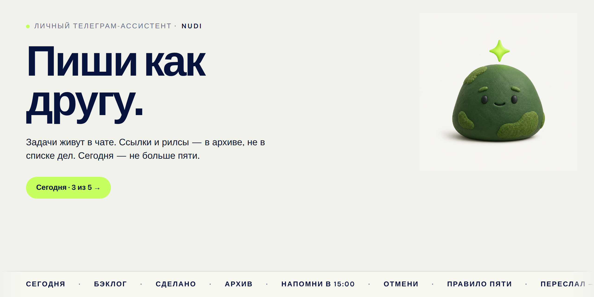
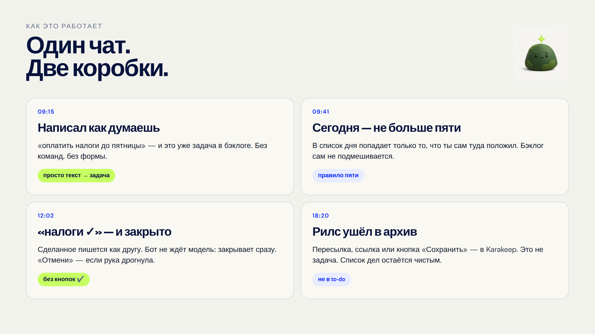
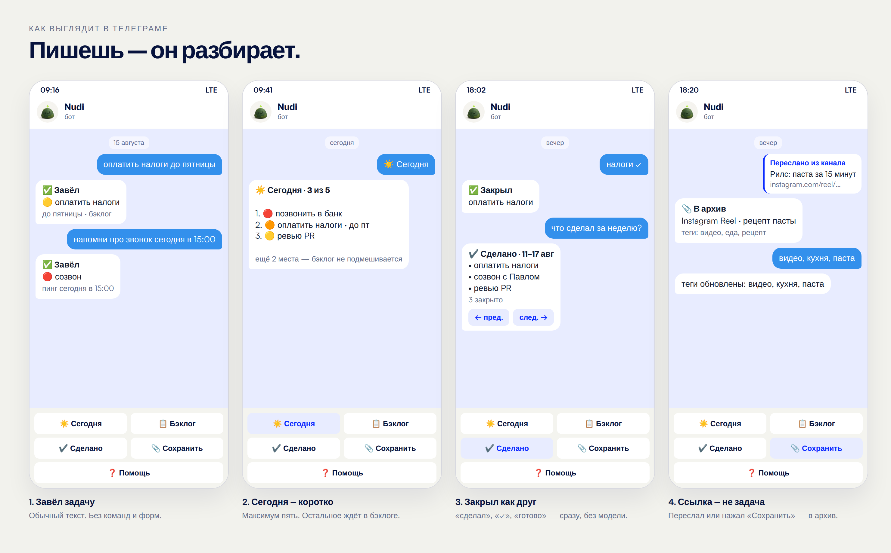

<p align="center">
  
</p>

<h1 align="center">Nudi</h1>

<p align="center">
  Personal Telegram assistant.<br />
  Talk like a human. Stay at five tasks. Keep links out of the to-do list.
</p>

<p align="center">
  
  
  
</p>

<p align="center">
  
</p>

Self-hosted. One Telegram user. One SQLite file. No Docker inside the bot process.

The Python package is still `nudge` (`uv run python -m nudge`). **Nudi** is the name you see in chat.

## How it works

You write in Telegram the way you think. Nudi splits the world into **two boxes**:

| You send | Where it goes |
| --- | --- |
| Plain text (`оплатить налоги`) | Tasks (SQLite) |
| «сделал налоги», `налоги ✓` | Closes a task — instantly, no model wait |
| Forwarded post, http(s) link, Reel, TikTok | Archive ([Karakeep](https://github.com/karakeep-app/karakeep)) |
| Button **📎 Сохранить**, then the next message | Archive |

Today is a **short list**: at most five. Inbox waits. Nothing is silently pulled in.

<p align="center">
  
</p>

<p align="center">
  
</p>

Keyboard: **Сегодня** · **Бэклог** · **Сделано** · **Сохранить** · **Помощь**. After you change it, send `/start` once.

## What you can say

- **Capture** — `оплатить налоги до пятницы`, `напомни про звонок сегодня в 15:00`
- **Close** — `сделал налоги`, `налоги ✓`, `готово` (or quote a `/today` line → `сделано`)
- **Move** — `на пятницу`, `на след неделю`, `отложи` (no date → inbox)
- **History** — `что сделал за неделю?` or `/done` (week pager ← →). Completed tasks are never purged.
- **Undo** — `отмени` rolls back the last turn.

Harder messages go through one OpenRouter tool-calling call (`gemini-2.5-flash-lite`, fallback `flash`). Phrases like «сделал X» never wait on the model.

## Stack

Python 3.12 · `python-telegram-bot` v21 · SQLite (WAL) · OpenRouter · optional [Karakeep](https://github.com/karakeep-app/karakeep) · optional Apify (TikTok/Reels transcript) · optional Airtable mirror.

SQLite always wins. Airtable is a second inbox, never the source of truth.

```
Telegram
   │
   ├─ archive route  →  Karakeep  (links, forwards, reels)
   ├─ fast path      →  complete / history / inbox   (no LLM)
   └─ assistant      →  OpenRouter tools → SQLite
```

## Run

```bash
uv sync
cp .env.example .env   # Telegram token, your user id, OpenRouter key
uv run python -m nudge
uv run pytest
```

Required: `TELEGRAM_BOT_TOKEN`, `TELEGRAM_ALLOWED_USER_ID`, `OPENROUTER_API_KEY`.  
Optional: `KARAKEEP_API_URL` + `KARAKEEP_API_KEY`, `APIFY_TOKEN`, Airtable.

This is a **single-user** bot. Anyone else who messages it is logged and dropped.

Deploy is one systemd unit (`scripts/nudge.service`) and `scripts/deploy.sh`. Edit the paths — the checked-in unit is an example for a small VPS.

## Layout

```
src/nudge/
  assistant.py    OpenRouter agent + tools
  fastpath.py     instant complete / history / inbox
  archive/        Karakeep + Apify enrich + routing
  handlers.py     Telegram commands + keyboard
  store.py        CRUD / undo / completed history
  priority.py     today ≤ 5
  digest.py       morning list + Sunday backlog
```

## License

[MIT](LICENSE) © 2026 Ilya Krivopustov
